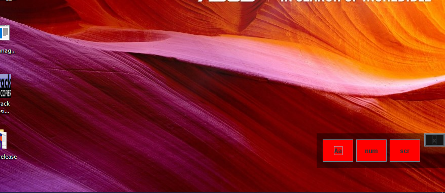

# Keyboard Indicator

A tiny program to assist users whose keyboards lack indicators (CAPS, num & scroll lock).

The window can be dragged in case of obstruction

It appears on top of every window.

- Small size since it should always be running even on low ram.

## Contributing
What is needed.
- Receive key states even on lost focus (background service?)
- Smaller installer since JRE occupies most of the space (app is < 1mb)
